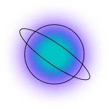

<p align="center">
  <a href="https://intergalactic.id">
    
  </a>
  <h3 align="center"><code>@intergalactic-net/intergalactic-satellites</code></h3>
  <p align="center">A collection of Intergalactic Satellites</p>
</p>

## About
This repository is a monorepo of [Kwil Extensions](https://docs.kwil.com/docs/extensions/quickstart/) as part of Intergalactic Network. In the Intergalactic Network terminology, Kwil Extensions are referred to as satellites.

## Credits
This monorepo has utilized the OSS code of [MEM's molecules](https://github.com/decentldotland/molecule), licensed under the MIT license.

## Build and run

```bash
git clone https://github.com/intergalactic-net/intergalatic-satellites.git

cd intergalatic-satellites

npm install && npm run build

docker build -t <EXTENSION_NAME> .
```

## Use the satellites

### Disclaimer
All of the satellites are currently unaudited and under development. Please use them at your own risk.

### Example Solana Auth

```sql
database solsat;

use intersigners {
    network: 'solana'
} as intergalactic_satellite;

table users {
    address text primary notnull,
    sig text notnull,
    res int notnull
}

action verify ($message, $address, $sig)  public {
    $res = intergalactic_satellite.verifySolSig($message, $address, $sig);

    INSERT INTO users
    VALUES($address, $sig, $res);
}
```

#### Input values examples:
- `$message` : `aGVsbG8gd29ybGQ=` (base64 encoded string equal to `hello world`)
- `$address` : `HPaeP1UwhNtiDexKrjeJNWmam7QnTKQNnuvMx3Ama2f7` (caller address)
- `$sig` : `4UXyCjhdDHVYhrodLExLnFuD6xWDcp4DYinSVFC8PmvEm3wo6oGb6oqiQ8KNVsysp2cTo5kBZBfHzV2EdxUCqWEn` (a valid sig)

## Satellites Design

All of the `verify*` methods return integer values `0` or `1` - `0` indicates invalid checks, while `1` indicates valid ones.

### List of PoC satellites

| method  | description |
| :-------------: |:-------------:|
| verifySolSig      | verify Solana signed message     |
| verifyEvmSig      | verify EVM signed message    |
| verifyArweaveSig      | verify Arweave signed message     |
| verifyNearSig      | verify Near signed message     |
| verifySplTransfer      | verify spl-token transfer     |

## License
This repository is licensed under the [MIT License](./LICENSE).